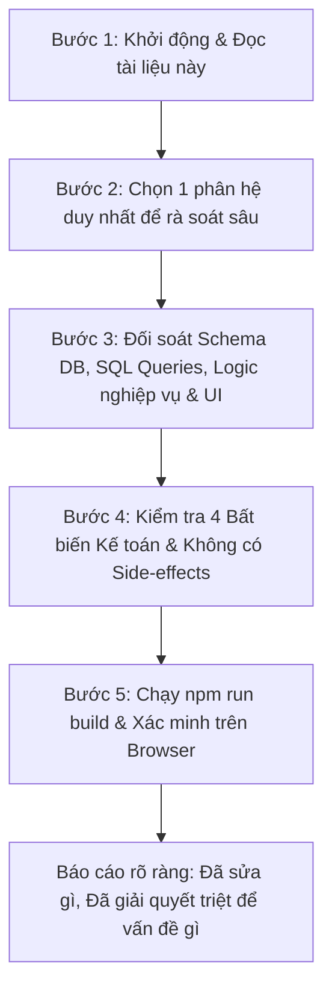

> Bản bàn giao Linux 29/09/2026: [bắt đầu tại đây](linux-handoff/START_HERE.md). Mốc D16; D17 chưa triển khai. Xem kết quả kiểm thử và giới hạn trong bộ bàn giao.

# TÀI LIỆU BÀN GIAO TOÀN DIỆN & KHUNG RÀ SOÁT HỆ THỐNG (MASTER AUDIT & SYSTEM HANDOVER)

> **D16 — tiêu hủy hàng lỗi sau trả:** [Quy trình, kiểm thử và giới hạn](PHASE_1_WAVE_D16_COMPLETION.md). Ghi phiếu từng phần/serial, giữ lịch sử, không trừ tồn hoặc ghi chi phí lần nữa, không đổi tiền hoàn. Luồng sửa chữa hàng lỗi vẫn chưa thuộc phạm vi này; chưa triển khai.

> **D15 — quyền từng nhân viên:** [Phân quyền cá nhân, bảo vệ giá vốn và kiểm tra máy chủ](PHASE_1_WAVE_D15_COMPLETION.md). Chỉ chủ cấp quyền; 15 công tắc, thu hồi phiên khi thay đổi, chặn giá/giảm giá/nợ/số dư và sửa xuất kho đồng bộ. Đã đạt kiểm tra đầy đủ; chưa triển khai.

> **D14 — mật khẩu nhân viên:** [Đổi mật khẩu và thu hồi phiên](PHASE_1_WAVE_D14_COMPLETION.md). Nhân viên tự đổi mật khẩu; tài khoản mới/được đặt lại phải đổi trước khi dùng nghiệp vụ. Đã kiểm tra giao dịch, cạnh tranh, API và giao diện.

> **D13 — tài khoản và phân quyền:** [Tài khoản nhân viên bán hàng](PHASE_1_WAVE_D13_COMPLETION.md). Có vai trò chỉ xem/thu ngân, kiểm tra quyền tại máy chủ, thu hồi phiên và ghi đúng người lập đơn. Đã kiểm tra trên bản có bật đăng nhập; quyền chuyên sâu và phạm vi còn lại xem tài liệu.

> **D12 — việc còn chờ:** [Danh sách hoàn tiền và hàng trả](PHASE_1_WAVE_D12_COMPLETION.md). Đã gom khoản chờ hoàn hai chiều, hàng chờ kiểm tra và hàng lỗi giữ riêng; có lọc, phân trang và mở đúng chứng từ. Phạm vi còn lại và thứ tự tiếp theo xem tài liệu.

> **D11 — kiểm tra hàng trả:** [Nhập lại kho và giữ riêng hàng lỗi](PHASE_1_WAVE_D11_COMPLETION.md). Xử lý từng phần, lưu lịch sử kiểm tra, hoàn lại giá vốn đúng phần nhập kho. Các bước sửa chữa/tiêu hủy và giới hạn khác xem tài liệu.

> **D10 — khách trả hàng:** [Tiếp nhận, giảm nợ và hoàn tiền](PHASE_1_WAVE_D10_COMPLETION.md). Trả từng dòng, giảm nợ trước, giữ hóa đơn. Hàng nhận lại chờ kiểm tra; bước kiểm tra/đưa lại lên kệ còn tiếp tục.

> **D9 — hoàn tiền đơn chưa giao:** [Hủy và hoàn tiền khách](PHASE_1_WAVE_D9_COMPLETION.md). Giữ thu gốc, chờ hoàn và ghi chi tại đơn; tách tiền mặt/số dư. Phiếu khách trả hàng đã giao còn tiếp tục.

> **D8 — báo cáo và công nợ:** [Phạm vi sửa báo cáo POS](PHASE_1_WAVE_D8_COMPLETION.md). Bỏ giá vốn giả định; tách tiền NCC chờ hoàn. Báo cáo còn tạm tính, xem giới hạn và việc tiếp theo trong tài liệu.

> **D7 — trả hàng đã nhập:** [Nghiệm thu trả NCC](PHASE_1_WAVE_D7_COMPLETION.md). Xuất trả theo dòng/serial, giữ phiếu gốc, giảm nợ trước và theo dõi nhận hoàn. Đã kiểm tra lỗi cuối, cạnh tranh và giao diện; xem giới hạn phiếu cũ/báo cáo trong tài liệu.

> **D6 — giá vốn và tiền trả dư:** [Nghiệm thu nhập hàng](PHASE_1_WAVE_D6_COMPLETION.md). Phân bổ giá vốn chính xác; giữ tiền chi gốc, nhận hoàn từng phần, theo dõi khoản còn chờ. Đã kiểm tra tạo–sửa–nhận–hủy–hoàn; trả hàng đã nhập và các giới hạn khác xem báo cáo.

> **Bước D5:** [Tạo nhập đồng bộ](PHASE_1_WAVE_D5_COMPLETION.md). Tạo trực tiếp/nháp cùng kho–quỹ–nợ trong một giao dịch, có chống gửi lại. Giá vốn và khoản trả dư chưa hoàn thiện; xem giới hạn trong báo cáo.

> **Bước D4:** [Bảo vệ sửa phiếu nhập](PHASE_1_WAVE_D4_COMPLETION.md). Sửa nháp nguyên tử, giữ tiền thực trả và kho lịch sử; biểu mẫu sửa không còn tạo mới. Tạo phiếu và xử lý khoản dư còn tiếp tục.

> **Bước D3 đã nghiệm thu:** [Hoàn tất phiếu đặt nhập](PHASE_1_WAVE_D3_COMPLETION.md). Kho, serial, thanh toán và công nợ cùng thành công hoặc cùng hoàn tác; đã thử giao diện trả một phần. Tạo/sửa phiếu và giá vốn vẫn cần hoàn thiện.

> **Bước D2:** [Kiểm tra dữ liệu trước ghi nhập hàng](PHASE_1_WAVE_D2_COMPLETION.md). Đã chặn đầu vào sai; chưa hoàn tất chuyển luồng nhập hàng sang giao dịch nguyên tử.

> **Bước D1 đã kiểm tra:** [Hủy đặt nhập và nhận tiền NCC hoàn lại](PHASE_1_WAVE_D1_COMPLETION.md). Chưa nghiệm thu tạo/sửa/hoàn tất nhập hàng hoặc trả hàng; xem phạm vi còn lại trong báo cáo.

> **Quy tắc mới đã chốt:** [Hủy, trả hàng và hoàn tiền](CANCELLATION_RETURN_AND_REFUND_CONTRACT.md). Hoàn tiền tại chứng từ gốc, tự tạo phiếu tiền sau xác nhận thực tế; số dư là lựa chọn. Thiết kế này thay hướng dẫn cũ tự hủy phiếu thu/chi và mặc định chuyển số dư.

> **Rà soát bước D:** [5 lỗi nhập hàng đã kiểm chứng trước sửa](PHASE_1_WAVE_D_PURCHASE_BASELINE.md). Chưa nghiệm thu bước D; quy tắc hoàn tiền đã chốt trong thiết kế mới.

> **Cập nhật bước C:** [Thu/trả nợ và sổ quỹ](PHASE_1_WAVE_C_COMPLETION.md) · [Quy tắc thanh toán công nợ](DEBT_AND_CASHBOOK_OPERATION_CONTRACT.md). Đã chặn thu sai khách, thu vượt và ghi dở nhóm chứng từ; dữ liệu trùng có chủ ý được giữ riêng.

> **Cập nhật bước B:** [Kho, thanh toán và số dư khách](PHASE_1_WAVE_B_COMPLETION.md) · [Quy tắc ghi nhận POS](POS_ATOMIC_OPERATION_CONTRACT.md). Kết quả bước B thay thế trạng thái các ca B01–B08 ở báo cáo mốc cũ. Bước A: [Khôi phục bộ kiểm tra](PHASE_1_WAVE_A_COMPLETION.md).

> **Kết quả kiểm chứng mới — Đợt 1:** [Hiện trạng và kế hoạch nghiệm thu](PHASE_1_BASELINE_AND_ACCEPTANCE_PLAN.md) · [Ma trận chức năng](SYSTEM_FUNCTION_INVENTORY.md). Phạm vi đã chốt: một cửa hàng, một kho; dữ liệu thử; chặn xuất bán thiếu tồn. Các mâu thuẫn nghiệp vụ trong hồ sơ này được liệt kê ở báo cáo đợt 1, chưa được coi là quy tắc đã nghiệm thu.
> **Dành riêng cho AI Model kế thừa có năng lực suy luận cao**  
> *Dự án: Kgame - Minshop (Hệ thống Quản trị Bán lẻ, Kho, Công nợ, Sổ quỹ & Sửa chữa Máy Game)*  
> *Cập nhật: 13/09/2026 | Trạng thái: MỞ HOÀN TOÀN ĐỂ RÀ SOÁT ĐỘC LẬP (OPEN-ENDED AUDIT)*

---

## 1. MỤC ĐÍCH TÀI LIỆU & TINH THẦN BÀN GIAO (MANDATORY INSTRUCTIONS)

### 1.1. Lý do tài liệu này ra đời
Người dùng (Chủ chuỗi cửa hàng Kgame) đã dành rất nhiều thời gian cùng các model trước đó để xây dựng hệ thống. Tuy nhiên, hệ thống vẫn tồn tại hiện tượng:
- **"Sửa chỗ này sinh lỗi chỗ khác" (Side-effects & Regression):** Sửa một hàm cập nhật nợ thì làm lệch báo cáo doanh thu; sửa logic hủy phiếu nhập thì sinh phiếu thu khống trong sổ quỹ; sửa dropdown thì làm lệch URL.
- **Thiếu hiểu biết sâu sắc về bản chất vận hành thực tế:** Nhiều tính năng được code dựa trên suy đoán lý thuyết của developer thay vì quy trình thực tế của cửa hàng (ví dụ: tự chế ra "Lệnh sản xuất" như nhà máy thép, chế nút "Xuất hủy bo cháy", đưa quảng cáo ngân hàng và số hotline 1900 của KiotViet vào trang nội bộ, đưa mã enum tiếng Anh `(INTERNAL_USE)` lên cho nhân viên kho đọc).
- **Người dùng không thể tiếp tục đi "bắt từng lỗi vụn vặt" cùng AI:** Người dùng cần một AI Model mạnh hơn có tư duy hệ thống cao, **tự giác đi rà soát từng trang, từng tính năng, từng câu query SQL**, đối chiếu với nguyên lý vận hành thực tế để tìm ra:
  1. Cái nào **SAI** (sai logic, tính toán sai, lệch bất biến kế toán).
  2. Cái nào **THIẾU** (thiếu tính năng sống còn như Kiểm kho, thiếu cột giá vốn, thiếu liên kết đơn hàng).
  3. Cái nào **TRÙNG** (các màn hình/chức năng xé lẻ vô lý, làm trùng việc của nhau).
  4. Cái nào **KHÔNG ĐÚNG BẢN CHẤT VẤN ĐỀ** (tên gọi kỳ quặc, giao diện giả lập, không giải quyết được bài toán quản trị).

### 1.2. Nguyên tắc vàng cho Model kế thừa: "KHÔNG KHÓA CHẾT ĐIỂM NÀO CẢ"
- **Toàn quyền đánh giá và tái cấu trúc:** Model mới **KHÔNG ĐƯỢC GIẢ ĐỊNH** rằng code hiện tại là đúng. Mọi bảng dữ liệu, mọi route, mọi logic nghiệp vụ trong tài liệu này là hồ sơ hiện trạng để tham chiếu, bạn hoàn toàn có quyền đề xuất thay đổi, gọt bỏ hoặc viết lại nếu nó đi ngược lại nguyên lý vận hành bán lẻ.
- **Tư duy từ nguyên lý đầu tiên (First Principles of Retail & Cashflow):**
  - Tiền ở đâu ra? Hàng ở đâu về? Khách nợ thì ai đòi? Hủy đơn thì kho và tiền chạy về đâu?
  - Không bao giờ được phép tạo dữ liệu ảo để "cho code chạy qua" hay "lấp chỗ trống".

---

## 2. BẢN ĐỒ TỔNG THỂ CÁC PHÂN HỆ VÀ ROUTE TRONG HỆ THỐNG

Dưới đây là danh mục toàn bộ các màn hình quản trị trong `src/pages/admin/` cần được rà soát độc lập:

```
src/pages/admin/
├── index.astro                       # [TỔNG QUAN / DASHBOARD]
├── products/                         # [HÀNG HÓA]
│   ├── index.astro                   # Danh sách hàng hóa, bộ lọc đa cấp
│   ├── new.astro                     # Thêm mới hàng hóa
│   └── [id]/                         # Chi tiết / Chỉnh sửa hàng hóa
├── categories/                       # [NHÓM HÀNG]
│   ├── index.astro                   # Cây danh mục nhóm hàng
│   ├── new.astro                     # Tạo nhóm hàng
│   └── [id]/edit.astro               # Sửa nhóm hàng
├── brands/                           # [THƯƠNG HIỆU]
│   └── index.astro                   # Danh sách thương hiệu (Cần đánh giá sự cần thiết)
├── units/                            # [SERIAL / IMEI]
│   └── lookup.astro                  # Tra cứu vòng đời Serial / Program Code
├── inventory/                        # [KHO HÀNG]
│   ├── index.astro                   # Sổ kho & Lịch sử xuất nhập hàng
│   └── outbound/new.astro            # Lập phiếu xuất kho khác (Xuất dùng / Xuất hủy)
├── production/                       # [LẮP RÁP / ĐÓNG GÓI]
│   ├── index.astro                   # Danh sách đợt ráp máy combo
│   └── new.astro                     # Tạo đợt lắp ráp máy từ linh kiện
├── purchases/                        # [MUA HÀNG / NHẬP HÀNG NCC]
│   ├── index.astro                   # Danh sách phiếu nhập hàng
│   ├── new.astro                     # Lập phiếu nhập hàng từ NCC
│   └── [id].astro                    # Chi tiết phiếu nhập hàng (Chi tiền / Hủy phiếu)
├── orders/                           # [BÁN HÀNG & ĐẶT HÀNG PRE-ORDER]
│   ├── index.astro                   # Danh sách đơn bán và đơn đặt hàng
│   ├── new.astro                     # Tạo đơn bán hàng / POS
│   └── [id].astro                    # Chi tiết đơn (Thu nợ, Fulfill cọc, Hủy đơn)
├── customers/ & partners/            # [ĐỐI TÁC: KHÁCH HÀNG & NHÀ CUNG CẤP]
│   ├── index.astro                   # Danh sách đối tác, lọc nợ khách, nợ NCC
│   ├── new.astro                     # Thêm mới đối tác
│   └── [id].astro                    # Chi tiết công nợ, lịch sử mua/bán/trả hàng
├── cash/                             # [SỔ QUỸ]
│   ├── index.astro                   # Sổ quỹ Thu - Chi thời gian thực, lọc dòng tiền
│   └── new.astro                     # Lập phiếu Thu / Phiếu Chi ngoài luồng
├── repairs/                          # [DỊCH VỤ SỬA CHỮA KỸ THUẬT]
│   ├── index.astro                   # Danh sách phiếu tiếp nhận sửa chữa
│   ├── new.astro                     # Tiếp nhận máy lỗi từ khách
│   └── [id].astro                    # Báo giá, xuất linh kiện thay thế, hoàn trả máy
├── reports/                          # [BÁO CÁO & PHÂN TÍCH]
│   ├── daily.astro                   # Báo cáo cuối ngày (Tiền thu, đơn bán, nợ mới)
│   ├── sales.astro                   # Báo cáo bán hàng (Doanh số theo nhân viên/kênh)
│   ├── orders.astro                  # Báo cáo đơn hàng & đặt hàng
│   ├── products.astro                # Báo cáo hàng hóa (Top bán, lợi nhuận)
│   ├── customers.astro               # Báo cáo khách hàng (Khách mua nhiều, công nợ)
│   └── financial.astro               # Báo cáo kết quả kinh doanh & dòng tiền
└── settings/                         # [CÀI ĐẶT CỬA HÀNG & HỆ THỐNG]
    └── index.astro                   # Thông tin cửa hàng, tài khoản thanh toán
```

---

## 3. BẢN ĐỒ CƠ SỞ DỮ LIỆU & RÀNG BUỘC (D1 SQLITE SCHEMA)

Hệ thống chạy trên **Cloudflare D1 (SQLite)**. Các bảng dữ liệu cốt lõi gồm:

1. **`products`**: Quản lý sản phẩm cha (tên, mã SKU, ĐVT, `stock_new`, `stock_used`, `cost_price_cents`, `cost_price_used_cents`, `sale_price_cents`, `tracking_mode`).
2. **`product_units`**: Quản lý từng chiếc máy cụ thể theo mã bộ / Serial (`program_code`, `availability`: `'IN_STOCK'`, `'HOLD'`, `'SOLD'`, `'DEFECTIVE'`, `'INTERNAL_USE'`, `'DISPOSED'`).
3. **`orders`**: Đơn hàng bán và đơn đặt cọc (`order_type`: `'ORDER'` | `'PREORDER'`, `order_status`: `'PENDING'`, `'PROCESSING'`, `'COMPLETED'`, `'CANCELLED'`, `amount_total_cents`, `paid_amount_cents`, `cod_amount_cents`).
4. **`order_lines`**: Chi tiết hàng bán trong đơn (`product_id`, `product_name_snapshot`, `quantity`, `condition`: `'NEW'` | `'QSD'`, `price_cents`, `cost_cents`, `line_total_cents`).
5. **`purchase_receipts`**: Phiếu nhập hàng từ Nhà cung cấp (`supplier_id`, `receipt_status`: `'COMPLETED'`, `'CANCELLED'`, `total_amount_cents`, `paid_amount_cents`, `debt_amount_cents`).
6. **`purchase_items`**: Chi tiết linh kiện trong phiếu nhập (`product_id`, `quantity`, `cost_cents`, `line_total_cents`).
7. **`cash_transactions`**: Sổ quỹ Thu - Chi (`flow_type`: `'IN'` | `'OUT'`, `amount_cents`, `category`, `reference_type`: `'ORDER'`, `'purchase_receipt'`, `'repair_ticket'`, `reference_id`, `status`: `'ACTIVE'` | `'CANCELLED'`).
8. **`inventory_transactions`**: Sổ thẻ kho ghi nhận biến động (`transaction_type`: `'PURCHASE'`, `'SALE'`, `'INTERNAL_USE'`, `'DISPOSAL'`, `'PRODUCTION_USE'`, `'PRODUCTION_OUT'`, `quantity`, `unit_cost_cents`).
9. **`partners`**: Danh bạ đối tác dùng chung cho cả Khách hàng (`is_customer = 1`) và Nhà cung cấp (`is_supplier = 1`).
10. **`repair_tickets`**: Tiếp nhận sửa chữa bo máy, thay linh kiện kỹ thuật.
11. **`stocktakes` & `stocktake_items`**: Bảng dữ liệu kiểm kê cân bằng kho (chưa có giao diện hoàn chỉnh).

---

## 4. BỘ 4 BẤT BIẾN KẾ TOÁN BẮT BUỘC KHÔNG ĐƯỢC VI PHẠM (INVARIANTS)

Bất kỳ tính năng mới nào được thêm vào hoặc sửa đổi đều phải vượt qua bài kiểm tra 4 bất biến sau:

### Bất biến 1: Công nợ Khách Hàng (Receivable Debt)
$$\sum_{\text{Khách hàng}} \text{Nợ phải thu} \equiv \sum_{\text{orders chưa hủy}} (\text{amount\_total\_cents} - \text{paid\_amount\_cents})$$
- **Ràng buộc:** Khách vãng lai (không gắn `customer_id`) **tuyệt đối không được phép nợ lại**. Muốn nợ bắt buộc phải chọn Khách hàng.

### Bất biến 2: Công nợ Nhà Cung Cấp (Payable Debt)
$$\sum_{\text{NCC}} \text{Nợ phải trả} \equiv \sum_{\text{purchase\_receipts chưa hủy}} (\text{total\_amount\_cents} - \text{paid\_amount\_cents})$$
- **Ràng buộc:** Trả nợ NCC phải cập nhật trực tiếp vào phiếu nhập phát sinh nợ đó. Tuyệt đối không tạo phiếu chi trôi nổi không gắn chứng từ gốc.

### Bất biến 3: Số Dư Sổ Quỹ (Cash Balance)
$$\text{Số dư hiện tại} \equiv \text{Số dư ban đầu} + \sum \text{Phiếu Thu ACTIVE} - \sum \text{Phiếu Chi ACTIVE}$$
- **Ràng buộc:** Khi HỦY đơn hàng hoặc HỦY phiếu nhập, **tuyệt đối không sinh phiếu Chi/Thu khống để đối ứng**. Phải chuyển trạng thái phiếu thu/chi gốc sang `CANCELLED`. Nếu sinh phiếu đối ứng, doanh số báo cáo sẽ bị phóng đại ảo gấp đôi.

### Bất biến 4: Tồn Kho Thực Tế (Stock Equilibrium)
$$\text{Tồn kho} \equiv \text{Tổng Nhập} - \text{Tổng Bán} - \text{Tổng Xuất dùng/Hủy} + \text{Tổng Hoàn trả}$$
- **Ràng buộc:** Hàng có mã Serial khi bán/xuất phải đổi trạng thái của Serial tương ứng. Hàng quản lý số lượng phải trừ trực tiếp vào `stock_new` hoặc `stock_used`.

---

## 5. BẢN TỔNG HỢP CÁC ĐIỂM YẾU, THIẾU SÓT VÀ CẦN RÀ SOÁT LẠI

Model kế thừa hãy sử dụng danh sách này làm kim chỉ nam để kiểm tra từng trang:

### 1. Phân hệ Hàng hóa & Kho hàng
- [ ] **Kiểm kho (Stocktake) bị bỏ rơi:** Cửa hàng bán lẻ linh kiện game có hàng trăm món ốc vít, nút bấm, bo mạch. Bắt buộc phải có trang Kiểm kho định kỳ để cân bằng giữa số đếm thực tế và số trên máy tính. Hiện tại menu chưa có giao diện kiểm kho.
- [ ] **Thẻ kho chi tiết:** Trang `/admin/inventory` hiện tại chỉ là nhật ký chung. Cần tính năng: Bấm vào 1 sản phẩm $\rightarrow$ Xem Thẻ kho riêng của món đó (Đầu kỳ bao nhiêu, những ngày nào nhập, những ngày nào bán, cuối kỳ còn bao nhiêu).
- [ ] **Giá vốn khi Lắp ráp Combo (`/admin/production`):** Khi lấy 1 vỏ máy, 1 bo nguồn, 8 nút bấm để ráp thành 1 bàn máy game, hệ thống cần tự động tính tổng giá vốn của các linh kiện con để gán làm giá vốn cho bàn máy mới sinh ra.
- [ ] **Rà soát lại danh mục Thương hiệu (`/admin/brands`):** Có cần thiết để thành 1 trang riêng lớn không, hay chỉ cần là 1 trường chọn trong cấu hình hàng hóa?

### 2. Phân hệ Đơn hàng & Bán hàng (POS / Pre-order)
- [ ] **Quy trình Fulfill Đơn đặt cọc (Pre-order):**
  - Khách cọc 2 triệu cho máy 10 triệu $\rightarrow$ Sinh phiếu thu cọc 2 triệu.
  - Khi máy về: Khách lấy máy, trả thêm 5 triệu, nợ lại 3 triệu.
  - **Logic bắt buộc:** Đơn hàng phải chuyển `order_type = 'ORDER'`, `order_status = 'COMPLETED'`, ghi nhận thu thêm 5 triệu, và số nợ 3 triệu phải nổi ngay trên hồ sơ công nợ của khách hàng đó. Không được để đơn ở trạng thái dở dang làm mất dấu nợ.
- [ ] **Trả hàng & Hoàn tiền (Order Returns):**
  - Khi khách trả lại máy: Nhập máy lại kho, hoàn tiền hoặc trừ vào nợ cũ của khách.
  - Cần kiểm tra xem có bảng hay chức năng Trả hàng chính thức chưa, hay chỉ đang xử lý bằng cách Hủy đơn.

### 3. Phân hệ Khách hàng & Nhà cung cấp
- [ ] **Tách biệt dòng tiền và lịch sử giao dịch:**
  - Tab Khách hàng: Chỉ hiển thị lịch sử mua hàng, lịch sử trả cọc, lịch sử sửa chữa và các khoản nợ của khách.
  - Tab Nhà cung cấp: Chỉ hiển thị lịch sử nhập hàng linh kiện và nợ phải trả NCC. **Tuyệt đối không hiển thị lịch sử sửa chữa hay đơn bán lẻ bên tab NCC.**
- [ ] **Thanh toán nợ gắn với chứng từ:**
  - Nút "Thanh toán nợ" phải cho chọn rõ: Thanh toán cho đơn hàng / phiếu nhập nào. Không tạo phiếu thu chi vô căn cứ.

### 4. Phân hệ Sổ quỹ & Báo cáo
- [ ] **Phân loại dòng tiền chuẩn:**
  - Tiền bán máy, tiền cọc, tiền thu nợ khách, tiền phí sửa chữa $\rightarrow$ Luồng Thu (`flow_type = 'IN'`).
  - Tiền trả NCC, tiền chi phí thuê mặt bằng, điện nước, phụ cấp $\rightarrow$ Luồng Chi (`flow_type = 'OUT'`).
- [ ] **Tính năng Drilldown trong Báo cáo:**
  - Khi bấm vào dòng "Doanh thu ngày 12/09: 25.000.000 đ", giao diện phải sổ ra danh sách chính xác các đơn hàng cấu thành con số 25 triệu đó. Không để người dùng nhìn con số chết mà không kiểm tra lại được.

### 5. Chuẩn mực Giao diện & Trải nghiệm (UI/UX)
- [ ] **Cấm tuyệt đối chữ mở ngoặc giải thích `(...)`:** Gọt bỏ mọi thứ như `(Bán hàng)`, `(3 cấp)`, `(Append-Only)`, `(Single Source of Truth)`.
- [ ] **Cấm tuyệt đối lộ mã enum backend:** Không để người dùng thấy `(INTERNAL_USE)`, `(DISPOSAL)`, `(PENDING)`.
- [ ] **Cấm văn phong cảm tính / nói chuyện đời thường:** Không dùng từ "chuột cắn", "giông sét", "bo cháy". Dùng ngôn ngữ quản trị: *Hư hỏng không thể phục hồi, Hao hụt kho, Chập cháy linh kiện*.
- [ ] **Loại bỏ quảng cáo & thành phần giả lập:** Không đưa hotline bên ngoài, không đưa dịch vụ vay vốn hay mã QR rác của bên thứ ba vào phần mềm quản trị nội bộ.

---

## 6. KHUNG QUY TRÌNH RÀ SOÁT DÀNH CHO MODEL MẠNH HƠN

Khi Model kế thừa bắt đầu làm việc, hãy thực hiện theo đúng 4 bước có phương pháp sau:



1. **Không làm dàn trải:** Hãy đi từng phân hệ một (ví dụ: xong trọn vẹn cụm Đơn hàng & Pre-order, rồi mới sang cụm Công nợ Khách hàng/NCC, rồi mới sang Sổ quỹ).
2. **Luôn kiểm tra side-effects:** Trước khi sửa câu SQL ở một trang, phải grep xem có trang báo cáo hay màn hình nào khác đang phụ thuộc vào cấu trúc đó không.
3. **Giữ hệ thống luôn biên dịch được (`npm run build` không lỗi):** Đảm bảo môi trường phát triển luôn sạch sẽ, không để lại lỗi cú pháp hay kiểu dữ liệu.

---
> **Tài liệu này là cam kết chất lượng của dự án Kgame-Minshop.**  
> Mọi thắc mắc về nghiệp vụ hãy đối chiếu lại với tài liệu này và [`docs/SYSTEM_BUSINESS_ARCHITECTURE.md`](file://<PROJECT_ROOT>/docs/SYSTEM_BUSINESS_ARCHITECTURE.md).
